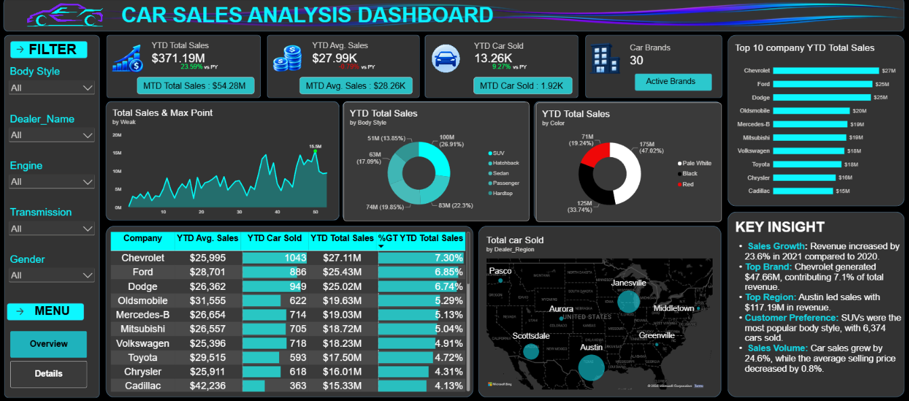
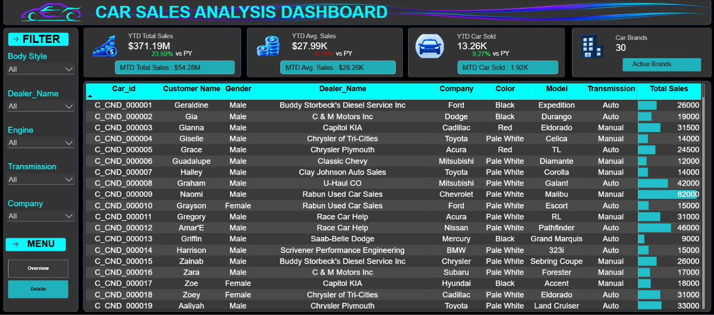

# Car Sales Analysis Dashboard

A business-focused Power BI solution developed to analyze car sales performance, understand revenue growth, identify sales-volume drivers, evaluate pricing movement, and support data-driven business decisions.

The dashboard transforms transaction-level car sales data into an interactive analytical solution covering **$371.19M in YTD sales, 13.26K cars sold, 30 brands, and a 23.59% sales growth**.

---

## Dashboard Preview

### Overview

<p align="center">
  
</p>

The Overview page provides an executive view of sales performance, KPIs, growth trends, brand contribution, product categories, and regional performance.

### Details

<p align="center">
  
</p>

The Details page provides transaction-level analysis, allowing users to investigate individual sales records through interactive filters and detailed sales attributes.

---

## Business Problem

The car sales dataset contains a large number of individual transactions across different brands, models, dealers, regions, body styles, colors, and customers.

Without a centralized analytical solution, management may face difficulty in understanding:

- Overall revenue performance
- Sales volume movement
- Average selling price
- Year-over-year growth
- Brand contribution
- Product-category performance
- Dealer and regional performance
- Areas requiring business attention

The key challenge was to transform detailed transactional data into a clear business view that could support faster and more informed decisions.

---

## Business Solution

The solution was developed as an interactive Power BI dashboard combining:

- Data preparation using Power Query
- Analytical data modeling
- Calendar-based time intelligence
- DAX business calculations
- KPI development
- Interactive visualizations
- Transaction-level analysis
- Business-focused storytelling

The solution allows management to move from:

**Raw Data → Performance → Growth → Business Drivers → Decision**

---

## Business Growth

The dashboard shows strong overall sales performance.

| Metric | Result |
|---|---:|
| YTD Total Sales | **$371.19M** |
| Sales Growth | **+23.59%** |
| YTD Cars Sold | **13.26K** |
| Cars Sold Growth | **+9.27%** |
| YTD Average Sales | **$27.99K** |
| Average Sales Change | **-0.79%** |
| Total Car Brands | **30** |

### Growth Story

The business generated **$371.19M in YTD sales**, representing a **23.59% increase** compared with the previous period.

During the same period, **13.26K cars were sold**, with sales volume increasing by **9.27%**.

However, average sales declined slightly by **0.79%**, reaching approximately **$27.99K**.

This creates an important business signal:

> Revenue is growing strongly, while average transaction value is experiencing slight pressure.

The results suggest that increased sales volume was an important contributor to the overall revenue growth. The next growth opportunity is therefore to maintain volume while improving pricing, product mix, and average transaction value.

---

## Key Business Insights

### Brand Performance

Chevrolet was the leading brand in the displayed sales analysis, making its product performance, pricing, dealer network, and regional contribution important areas for further investigation.

### Product Performance

SUVs were the strongest body-style category, indicating significant customer demand within this segment.

### Customer Preference

Pale White was the leading color category by sales, providing an additional indication of customer preference within the analyzed dataset.

### Growth Opportunity

The combination of **23.59% revenue growth**, **9.27% cars-sold growth**, and a **0.79% decline in average sales** indicates an opportunity to increase transaction value without sacrificing sales volume.

---

## Business Recommendations

### Protect High-Volume Segments

Maintain sufficient inventory and sales support for high-demand categories such as SUVs.

### Improve Average Transaction Value

Explore premium models, accessories, financing options, and upselling opportunities to increase revenue per transaction.

### Review Pricing Strategy

Investigate whether discounts, product mix, or regional pricing are contributing to the **0.79% decline in average sales**.

### Strengthen Dealer Performance

Compare dealer-level results to identify successful sales practices and improvement opportunities.

### Optimize Regional Strategy

Use regional performance analysis to improve resource allocation, inventory planning, and targeted sales activities.

---

## Dashboard Capabilities

The dashboard provides:

- Executive KPI monitoring
- YTD sales analysis
- MTD sales analysis
- Previous-year comparison
- Growth analysis
- Brand performance analysis
- Body-style analysis
- Color analysis
- Dealer analysis
- Regional analysis
- Transaction-level investigation
- Interactive filtering
- Business-focused data storytelling

---

## Technical Approach

The project follows a structured Business Intelligence workflow:

```text
Raw Excel Dataset
        |
        v
Data Preparation
        |
        v
Power Query
        |
        v
Data Modeling
        |
        v
Calendar Table
        |
        v
DAX Measures
        |
        v
KPI Development
        |
        v
Dashboard Development
        |
        v
Business Analysis
        |
        v
Insights
        |
        v
Business Recommendations
```
---

## DAX & Time Intelligence

DAX was used to create the core business calculations required for performance and growth analysis.

The project includes calculations for:

- Total Sales
- YTD Sales
- Previous-Year Sales
- Sales Growth %
- MTD Sales
- Average Sales
- YTD Average Sales
- Previous-Year Average Sales
- Average Sales Growth %
- Total Cars Sold
- YTD Cars Sold
- Previous-Year Cars Sold
- Cars Sold Growth %
- MTD Cars Sold
- Car Brand Count
- Maximum Sales Point

A dedicated Calendar Table supports date-based analysis and time intelligence.

---

## Technical Skills Demonstrated

### Power BI

- Interactive dashboard development
- KPI design
- Business visualization
- Interactive filtering
- Transaction-level analysis
- Data storytelling

### DAX

- Aggregation
- Time intelligence
- YTD analysis
- MTD analysis
- Previous-year comparison
- Growth calculations
- KPI calculations

### Power Query

- Data cleaning
- Data transformation
- Data-type management
- Data preparation

### Data Modeling

- Calendar Table
- Date relationships
- Time-intelligence structure
- Analytical data model

### Business Analytics

- KPI interpretation
- Growth-driver analysis
- Brand analysis
- Product analysis
- Regional analysis
- Pricing analysis
- Business recommendations

---

## Dataset

The project uses an Excel-based car sales transaction dataset containing information related to:

- Car ID
- Date
- Customer Name
- Gender
- Annual Income
- Dealer Name
- Company
- Model
- Engine
- Transmission
- Color
- Price
- Dealer Number
- Body Style
- Dealer Region

---

## Project Resources

| Resource | Description |
|---|---|
| [Power BI Dashboard](./Overview/Car_Sales_Analysis_Dashboard.pbix) | Complete Power BI dashboard |
| [Project Documentation](./Documentation/Car_Sales_Analysis_Documentation_Final.md) | Detailed project documentation |
| [Car Sales Dataset](./Data%20Set/Car_Sales_Data.xlsx) | Source Excel dataset |
| [Calendar Table DAX](./DAX%20Formulas/Calender_Table_Measures.md) | Calendar and time-intelligence calculations |
| [Sales Measures](./DAX%20Formulas/Sales_Measures.md) | Sales and growth calculations |
| [Average Sales Measures](./DAX%20Formulas/Avg_Sales_Measures.md) | Average sales calculations |
| [Car Sold Measures](./DAX%20Formulas/Car_sold_Measures.md) | Vehicle volume calculations |

---

## KPI Assets

The dashboard uses custom KPI visual assets stored in the repository.

```text
KPI Images/
├── Avg_Sales.png
├── Car_Brands.png
├── Car_sold.png
├── Header_Line.png
└── Total_Sales.png
```
---


## Repository Structure

```text
Car-Sales-Analysis-Dashboard/

├── Data Set/
│   └── Car_Sales_Data.xlsx
│
├── DAX Formulas/
│   ├── Avg_Sales_Measures.md
│   ├── Calender_Table_Measures.md
│   ├── Car_sold_Measures.md
│   └── Sales_Measures.md
│
├── KPI Images/
│   ├── Avg_Sales.png
│   ├── Car_Brands.png
│   ├── Car_sold.png
│   ├── Header_Line.png
│   └── Total_Sales.png
│
├── Overview/
│   ├── Car_Sales_Analysis_Dashboard.pbix
│   ├── Car_Sales_Analysis_Dashboard_Overview_Preview.png
│   └── Car_Sales_Analysis_Dashboard_Details_Preview.png
│
│── Documentation/
│   └── Car_Sales_Analysis_Documentation_Final.md
│
├── Car_Sales_Analysis_Dashboard.pbix
│
│
├── README.md


```
---

## Future Improvements

The project can be extended toward advanced Business Intelligence capabilities such as:

- Sales forecasting
- Demand forecasting
- Profitability analysis
- Customer segmentation
- Customer lifetime value
- Dealer target vs actual analysis
- What-if pricing analysis
- Anomaly detection
- Prescriptive analytics
- Automated data refresh
- Power BI Service deployment
- Row-Level Security
- Advanced drill-through
- Calculation Groups
- Field Parameters
- DAX performance optimization
- VertiPaq model optimization

---

## Tools & Technologies

| Technology            | Purpose                                     |
| --------------------- | ------------------------------------------- |
| Power BI              | Dashboard and reporting                     |
| DAX                   | Business calculations and time intelligence |
| Power Query           | Data preparation and transformation         |
| Microsoft Excel       | Source dataset                              |
| Data Modeling         | Analytical data structure                   |
| Business Intelligence | Decision support                            |
| Data Visualization    | Business storytelling                       |

---

## Project Outcome

The project demonstrates how transaction-level sales data can be transformed into a structured Business Intelligence solution.

The analysis identified:

- **$371.19M** in YTD sales
- **23.59%** revenue growth
- **13.26K** cars sold
- **9.27%** growth in sales volume
- **$27.99K** average sales
- **0.79%** decline in average sales
- **30** car brands

The overall business story is clear:

**Strong revenue growth is being supported by higher sales volume, while average transaction value shows a slight decline.**

This creates an opportunity to maintain volume growth while improving pricing, product mix, and transaction value.

----


## Conclusion

This Car Sales Analysis Dashboard transforms raw sales data into a clear Business Intelligence solution for understanding sales performance and growth.

The analysis shows **23.59% revenue growth** and **9.27% growth in cars sold**, while average sales declined slightly by **0.79%**. This indicates that higher sales volume is the primary driver of revenue growth.

The dashboard helps identify high-performing brands, body styles, colors, and sales trends, enabling better decisions around **pricing, product mix, inventory, and sales strategy**.

Overall, the project demonstrates how **Power BI, DAX, Power Query, and data visualization** can convert transaction-level data into actionable business insights.
